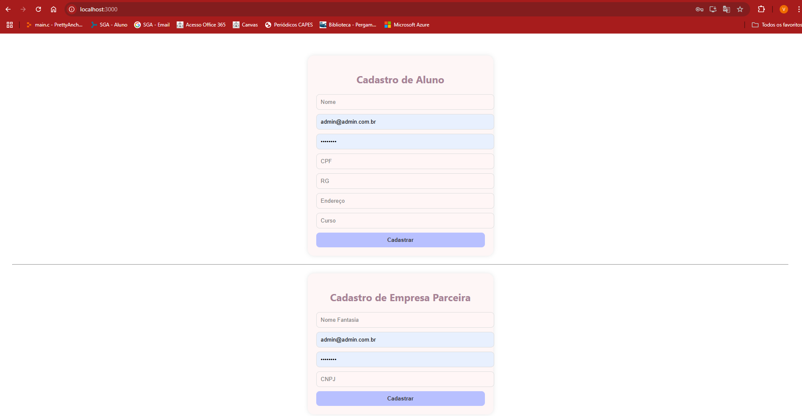
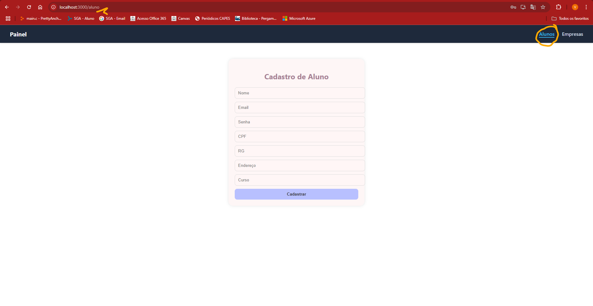
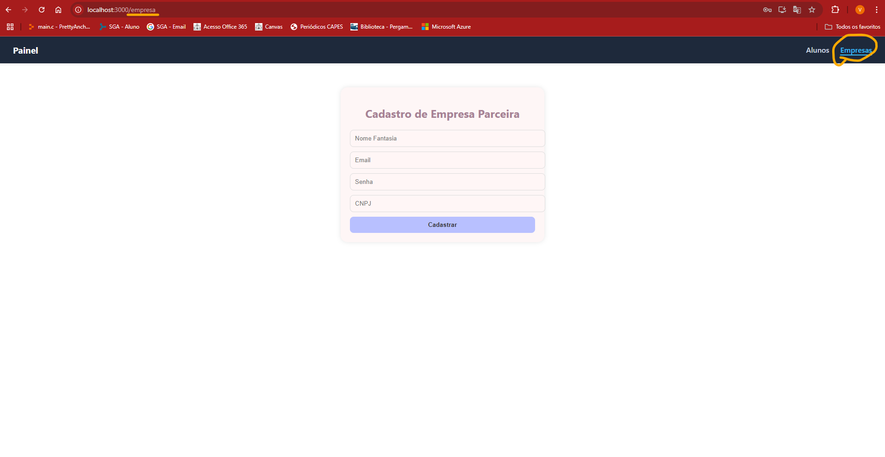

# Relatório de Análise Crítica e Refatoração do Projeto realizado pelo G4

## 1. Identificação do Grupo Avaliador

**Grupo Avaliador:** G3  
**Integrantes:**

- Lucas Giovine
- Pedro Porto
- Vitor Rebula
- Thiago Cury

## 2. Análise Crítica do Projeto

### 2.1. Arquitetura e Tecnologias Utilizadas

- Descrição da arquitetura:  
  A aplicação segue o padrão de arquitetura MVC (Model–View–Controller), estendido com o uso das camadas Service e Repository(DAO), abordagem comum em projetos desenvolvidos com Spring Boot. Essa estrutura favorece a separação de responsabilidades, tornando o sistema mais modular, testável e de fácil manutenção.

- Tecnologias:
  O backend foi desenvolvido em Java utilizando o framework Spring Boot. O frontend utiliza React com JavaScript. O sistema adota o banco de dados relacional MySQL para persistência das informações.

- Observações:
  A arquitetura adotada é sólida e adequada à proposta da aplicação. Os diretórios estão bem organizados e pertinentes para o back-end, já para o front-end, os diretórios não seguem um padrão muito claro, dificultando a escalabilidade do código.

### 2.2. Organização do GitHub

O GitHub apresenta todas as informações pertinentes ao trabalho, um único ponto de atenção seria uma descrição de como utilizar o software no README principal, e como instalá-lo, bem como as imagens dos diagramas desenvolvidos.

### 2.3. Dificuldade para Configuração do Ambiente

Como o repositório não apresenta instruções detalhadas sobre como executar o sistema localmente, usuários que não estejam familiarizados com tecnologias como Spring Boot, React ou configurações de banco de dados podem encontrar muita dificuldade para rodar o projeto.

### 2.4. Sugestões de Melhorias

- A inclusão de um guia de instalação no README seria uma ótima melhoria para facilitar o uso e a contribuição de terceiros;
- Em relação ao código, as refatorações são melhorias plausíveis, que auxiliam na manutenibilidade e expansão do código;
- Para o front-end, recomendaria a utilização do typescript, pois auxilia com as tipagens, a manter um código coeso e estruturado, ajudando o desenvolvedor a prevenir erros, quando bem usado;
- Uma alternativa viável, especialmente em cenários de grande volume de dados — como no caso da estrutura de Transações —, seria considerar o uso de um banco de dados não relacional.

## 3. Refatorações Realizadas

### 3.1. Resumo das Refatorações

As refatorações foram focadas em melhorar a legibilidade do código, a organização de responsabilidades e a padronização de nomenclaturas. Os pontos escolhidos refletem boas práticas que podem facilitar a manutenção futura do sistema, e a sua expansão.

### 3.2. Refatoração 1: Separação de serviços por entidade

**Antes da refatoração:**  
Todas as requisições HTTP estavam sendo usadas dentro dos próprios componentes.

**Depois da refatoração:**  
Foi criada uma pasta `services/` contendo arquivos separados para cada entidade (`alunoService.js`, `empresaService.js`), centralizando ali todas as requisições relacionadas àquela entidade.

**Refatoração aplicada:**  
- Criação de arquivos separados por entidade no diretório de serviços.
- Organização de todas as funções de requisição em seus respectivos arquivos.

**Justificativa da mudança:**  
Essa separação melhora a manutenibilidade, pois alterações em uma rota precisam ser feitas apenas em um local. Também facilita a reutilização e o entendimento do código, especialmente conforme novas entidades forem sendo adicionadas à aplicação.

---

### 3.2. Refatoração 2: Organização estrutural por páginas

**Antes da refatoração:**  
Todos os componentes do sistema estavam dentro de uma única pasta `components/`, sem distinção entre componentes globais e específicos de páginas.

**Depois da refatoração:**  
A estrutura foi reorganizada para adotar o padrão page-based. Agora existe uma pasta `pages/` que contém subpastas para cada página da aplicação, como `AlunosPage/` e `EmpresaPage/`. Dentro de cada uma, há uma pasta `components/` para seus elementos internos e um `index.jsx` como ponto de entrada da página.

**Refatoração aplicada:**  
- Criação da pasta `pages/` com subpastas por domínio funcional.
- Separação entre componentes globais (`/components`) e específicos de página (`pages/X/components/`).

**Justificativa da mudança:**  
Esse padrão melhora a coesão e o isolamento dos componentes, facilitando a localização de código e manutenção. Em projetos maiores, esse tipo de organização é essencial para escalabilidade e clareza na arquitetura do front-end.

---

### 3.2. Refatoração 3: Implementação de sistema de rotas com React Router

**Antes da refatoração:**  
O componente `App.js` carregava diretamente os formulários de Aluno e Empresa na mesma página, separados por um `hr`, dificultando a navegação e a escalabilidade.

**Depois da refatoração:**  
Foi implementado o `react-router-dom` para criar rotas separadas para cada página. Também foi criado um componente `Navbar`, com links de navegação entre as rotas.

**Refatoração aplicada:**  
- Instalação e configuração do React Router.
- Criação de um componente `Navbar`.
- Definição de rotas separadas no `App.js` para `Aluno` e `Empresa`.

**Justificativa da mudança:**  
Essa alteração melhora a experiência do usuário, organiza melhor o fluxo da aplicação e facilita a adição de novas páginas (como uma futura `InstituiçãoPage`). Também isola responsabilidades, permitindo que cada página tenha seu próprio ciclo de vida e escopo.

---

## 4. Considerações Finais

A experiência de análise e refatoração do projeto proporcionou uma compreensão mais concreta dos reais desafios envolvidos nesse tipo de atividade, que vai muito além de simplesmente “mexer no código”. Refatorar exige visão crítica, conhecimento técnico e atenção aos detalhes. É um processo que demanda identificar pontos frágeis, gargalos estruturais e trechos de código com baixa legibilidade ou alta acoplabilidade, propondo soluções que realmente agreguem valor ao sistema.

Durante a refatoração, ficou evidente o quanto a organização do código, a separação de responsabilidades e a adoção de boas práticas de arquitetura impactam positivamente na manutenibilidade e escalabilidade da aplicação. A reestruturação de pastas, a padronização dos serviços por entidade e a criação de uma estrutura de rotas bem definida com navegação clara são exemplos de decisões que tornam o código mais sustentável a longo prazo.

Além disso, essa atividade reforçou a importância de escrever um código limpo, modular, reutilizável e intuitivo, especialmente em projetos colaborativos ou que tendem a crescer com o tempo. Desenvolver essa habilidade de olhar crítico para o próprio código e o de outras pessoas é um diferencial essencial na formação de um desenvolvedor completo.

Refatorar é, acima de tudo, um exercício de cuidado com a qualidade do software. É garantir que o sistema não apenas funcione, mas seja também fácil de entender, manter e evoluir.
